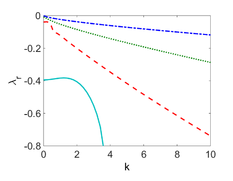

# CouetteFlow


This directory contains a Chebyshev collocation method to compute the eigenvalues of the Orr-Sommerfeld equation in case of <b>Couette Flow</b>.  The Couette flow is covered in <b>Section 4.5.1</b> of the reference textbook.

The code structure is a little bit complicated.  Calls to the core solver `OS_sover.m` are handled by various wrap-around functions, supported by:

* `fix_all_parameters.m`
* `get_u.m`

# fix_all_parameters

In this code, the Reynolds number $Re$ and the truncation number $N_1$ are fixed.  Correspondingly, there are $N_1+1$ Chebyshev polynomials used in the truncation.

# get_u

In this code, the value of $N_1$ is read in from `fix_all_parameters.m` and the values of the fluid velocity (Couette flow) and it second derivative are computed at the Chebyshev collocation points.  The inputs are null, and the outputs are:

* `u_vec` - the values of the fluid velocity evaluated at the Chebyshev collocation points;
* `ddu_vec` - the values of the second derivative of the fluid velocity, evaluated at the Chebyshev collocation points.  <b>Note:</b> these are zero for Couette flow.
* `z` - the values of z at the Chebyshev collocation points.

# OS_solver


This is the core of the solver.  The <b>inputs</b> are the wavenumber $\alpha$ (scalar-valued), and the arrays `u_vec1` and  `ddu_vec1`, obtained previously.  The code takes these inputs and builds a discrete approximation:

$$La=\lambda Ma$$

to the Orr-Sommerfeld equation.  This is a generalized eigenvalue problem in linear algebra.  Correspondingly, the output of the code is an array $\lambda$, which contains the first $N+1$ eigenvalues of the generalized eigenvalue problem.

# main_temporal

Calls to `OS_solver` are wrapped in the `main_temporal` function.  The inputs to `main_temporal` are null.  The outputs are an array of wavenumbers:

`alpha=0:0.2:10;`

and corresponding eigenvalues:

```matlab
sizezero=0*(1:length(alpha));
lambda1=sizezero;
lambda2=sizezero;
```

… all the way down to `lambda10`.

A "for" loop is constructed:

```matlab
for i=1:length(alpha)
        alpha_param=alpha(i);
        [lambda,~,~]=OS_solver(alpha_param,u_vec1,ddu_vec1);
        [~,ix]=max(real(lambda));
        v1=lambda(ix);
        lambda(ix)=-1000;
        [~,ix]=max(real(lambda));
        v2=lambda(ix);
```
… and so on, all the way down to `lambda10`.  

In this way, the first 10 eigenvalues (sorted by largest real part) are picked out, at each value of $\alpha$, and stored in appropriate arrays.  Results may be visualized by plotting:

`plot(alpha,lambda1)`

Sample results are shown in the figure below.  Again, we use $\alpha$ and $k$ interchangeably, to denote wavenumber.





