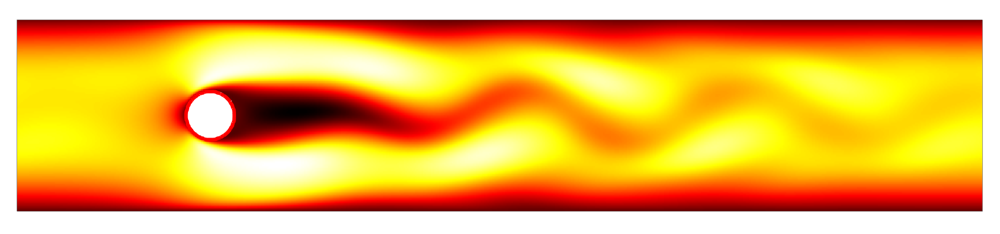

# Hydrodynamic Instability: From Theory to Simulations

Welcome to the GitHub Repository for the textbook <i>Hydrodynamic Instability: From Theory to Simulations</i>.  This is an upper-level textbook devoted to the theory and computation of hydrodynamic instability.  Many of the chapters of this book involve in-depth computations, in which various theoretical concepts and formulas are worked out, to give quantitative predictions of instability.  The following sub-directories correspond to those book chapters involving numerical computation.  By clicking through, you will find the code base and detailed instructions, in case these are of use to readers.

The figure below shows a simulation which was generated with a variant of the sTPLS, which was modified to include an immersed-boundary force which simulations the presence of obstacles.  In this way one can visualize 
vortex shedding (itself a consequence of hydrodynamic instability) in parallel flow past an obstacle.

# [RayleighBenard](https://github.com/onaraighl/hydroDynInstability/tree/main/RayleighBenard)

This directory contains some simple codes to evaluate the dispersion relation in Rayleigh-Bénard convection. The dispersion relation is obtained by solving an eigenvalue problem. The directory also contains some more sophisticated codes to evaluate the corresponding eigenfunctions and hence, to visualize convection rolls for 2D convection patterns.

# [Spectral](https://github.com/onaraighl/hydroDynInstability/tree/main/Spectral)

This directory contains some simple codes to obtain the eigenvalues and eigenfunctions of a simple 1D boundary value problem, for which exact solutions are known.  In this way the proposed numerical method can be validated before being extended to scenarios in which the eigenvalues are not known <i>a priori</i>.

# [RayleighTaylor](https://github.com/onaraighl/hydroDynInstability/tree/main/RayleighTaylor)

This directory contains codes to compute the eigenvalues of the Rayleigh-Taylor problem (viscous case).  The codes are based on a Chebyshev collocation method.  The ordinary differential equations for each phase are discretized.  Matching conditions are applied at the interface.  The eigenvalue problem is then approximated as a generalized eigenvalue problem, and the eigenvalues are estimated using numerical linear algebra.

# [CouetteFlow](https://github.com/onaraighl/hydroDynInstability/tree/main/CouetteFlow)

This directory contains a Chebyshev collocation method to compute the eigenvalues of the Orr-Sommerfeld equation in case of Couette Flow. 

# [PoiseuilleFlow](https://github.com/onaraighl/hydroDynInstability/tree/main/PoiseuilleFlow)

This directory contains a Chebyshev collocation method to compute the eigenvalues of the Orr-Sommerfeld equation in case of Poiseuille Flow. 

# [AbsoluteInstability](https://github.com/onaraighl/hydroDynInstability/tree/main/AbsoluteInstability)

This directory contains a Chebyshev collocation method to compute the eigenvalues of the Orr-Sommerfeld equation in case of a mixing-layer flow.

