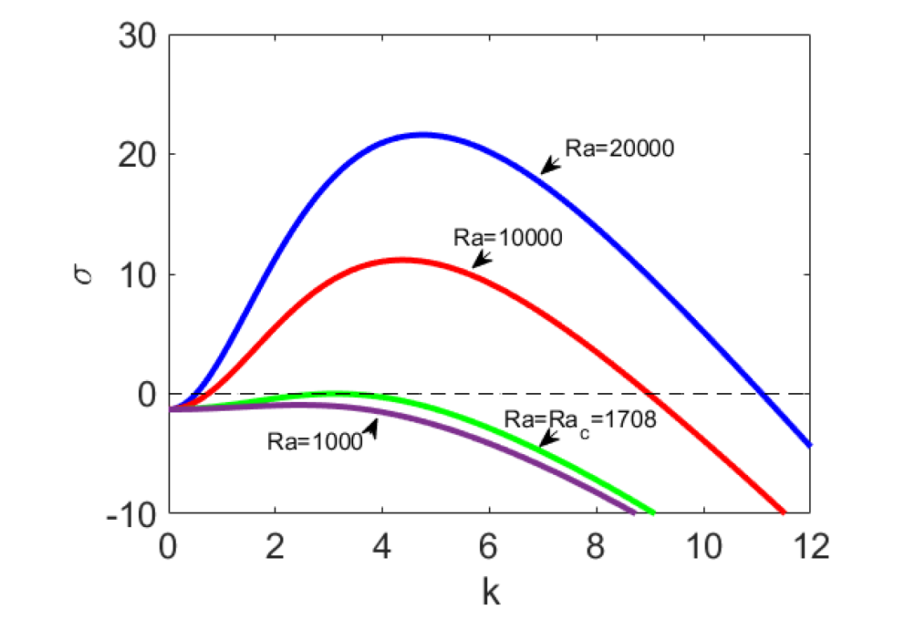

# RayleighBenard

This directory contains some simple codes to evaluate the dispersion relation in Rayleigh-Bénard convection.

# my_rayleigh_benard0

This code computes the critical Rayleigh number for the onset of instability, for a given wavenumber k (even case).  An initial guess for the critical Rayleigh number needs to be supplied.  The code corresponds to <b>Algorithm 1.1</b> in the reference text.

# my_rayleigh_benard1

This code generates the neutral curve for the onset of instability (even case).  Inputs: null.  Outputs: k\_vec and Ra\_vec.  Here, k\_vec refers to an array of wavenumbers, and Ra\_vec is the corresponding array of critical Rayeligh numbers.  The curve can be visualized by plotting:

`plot(k_vec,Ra_vec)`

This code corresponds to <b>Algorithm 1.2</b> in the reference text.

# get_eval

This code is a root-finding algorithm to obtain the allowed value of sigma (=sigma_eig) for the Rayleigh-Bénard problem - Even case.  

The code takes in the prescirbed values of Rayleigh number (Ra), Prandtl number (Pr), and wavenumber (k).  It also requires an initial guess for sigma_eig.

The code then sets up the cubic polynomial equation to solve and the resulting determinant equation.  The determinant equation is to be solved to give the allowed value of sigma_eig.  The determinant equation is solved using root-finding.

Sample results are shown below - the dispersion relation for the even mode of the Rayleigh-Bénard instability for a variety of Rayleigh numbers and for fixed Prandtl number 7.56, corresponding to the Prandtl number of water at room temperature.

# get_eval_with_kernel

This is the same as `get_val` except now a 3x3 matrix $M$ is also returned.  The idea is that $M(\sigma)$ is a special matrix, such that non-trivial solutions of the Rayleigh-Bénard problem occur only when is singular.  Thus, the values of $\sigma$ for which $\det[M(\sigma)]=0$ are the eigenvalues of the Rayleigh-Bénard problem, previously computed.

If we call the eigenvalue $\sigma_* $, then the corresponding eigenfunction can be found from vectors which span the kernel of $M(\sigma_*)$.

In a nutshell, `get_eval_with_kernel` takes the following inputs:

* Ra - Rayleigh number (scalar)
* Pr - Prandtl number (scalar)
* k - wavenumber (scalar)
* sigma_guess - guess for eigenvalue 

The following outputs are produced:

* sigma_eig - true value of eigenvalue
* M_ker - the 3x3 singular matrix M
* z_vec - array of z-value, ranging from -0.5 to 0.5
* W_vec - array of eigenfunction values, for the corresponding z-values

Outputs can be plotted using:

`plot(z_vec,W_vec)`

