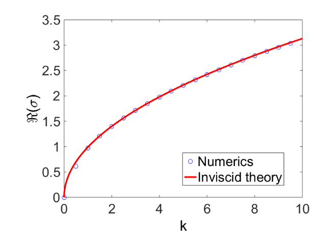

# RayleighTaylor

This directory contains codes to compute the eigenvalues of the Rayleigh-Taylor problem (viscous case).  The codes are based on a Chebyshev collocation method.  The ordinary differential equations for each phase are discretized.  Matching conditions are applied at the interface.  The eigenvalue problem is then approximated as a generalized eigenvalue problem, and the eigenvalues are estimated using numerical linear algebra.

# OS_rti

`OS_rti.m` is a complicated eigenvalue solver which discretizes the two-phase Rayleigh-Taylor problem in the liquid domain and separately, in the gas domain.  The discretization is done using Chebyshev polynomials.  Then, matching conditions are applied across the interface of the two phases, leading to a generalized
eigenvalue problem:

$$
La=\lambda Ma
$$

The wavenumber $\alpha$ (scalar-valued) is the only input into the code.  Note that $k$ is used for wavenumber in the reference text.  All other parameters are hard-coded:

* nuL- depth of liquid layer
* nuG - depth of gas layer
* m - viscosity ratio
* r_bottom - bottom-layer density (lighter)
* r_top - top-layer density (heavier)
* St - surface-tension parameter
* Grav - gravity parameter
* ReG - Reynolds number
* N_1 -  N_1+1 is number of Chebyshev polynomials in the liquid layer
* N_21 - N_21 is the number of Chebyshev polynomials in the gas layer

The code returns all eigenvalues $\lambda$ in the discretization. 

# call_OS_rti

This code generates an array of wavenumber values:

`alpha_vec=1e-6:0.5:10;`

For each element in this array, the code `OS_rti` is run and the eigenvalue with maximum real part is picked out.  These values are stored in the array `lambda_vec`.

Results can be visualized (e.g. in the figure) by plotting:

`plot(alpha_vec,lambda_vec)`

