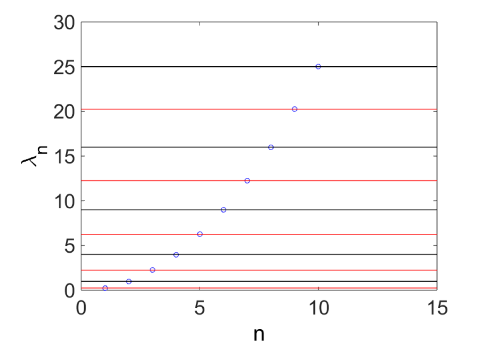

# Spectral

This directory contains some simple codes to obtain the eigenvalues and eigenfunctions of a simple 1D boundary value problem, for which exact solutions are known. In this way the proposed numerical method can be validated before being extended to scenarios in which the eigenvalues are not known a priori.

The simple 1D problem starts with the following ordinary differential equation (ODE):

$$
\frac{d^2f}{dy^2}=-\lambda f.
$$

The domain is given as $y\in (-L/2,L/2)$, and homogeneous boundary conditions are assumed on either end:

$$
f(-L/2)=f(L/2)=0.
$$

# simple

This code recasts the differential equation as a generalized eigenvalue problem:

$$
La=\lambda Ma
$$

This equation represents a disrectization and a truncation of the differential equation with $N+1$ degrees of freedom.

The code uses numerical linear algebra in Matlab to compute the first  $N+1$ eigenvalues $\lambda$.  This code corresponds to <b>Algorithm 3.1</b> in the reference text.  Sample results are shown below, along with a comparison between the numerical method and the theoretical value of the eigenvalues, which is known iexactly.  Here, $N=100$ and $L=2\pi$.

# make_eigenfunction_simple

This code builds on `simple`  The code takes the maximum eigenvalue from the set

$$
\lambda_{max}=(\lambda_1,...,\lambda_{N_1})
$$

and computes the correspnoding eigenvector.  The eigenvector (really, eigenfunction) can be visualized by plotting:

`plot(y,psi)`

 This code corresponds to <b>Algorithm 3.2</b> in the reference text.

