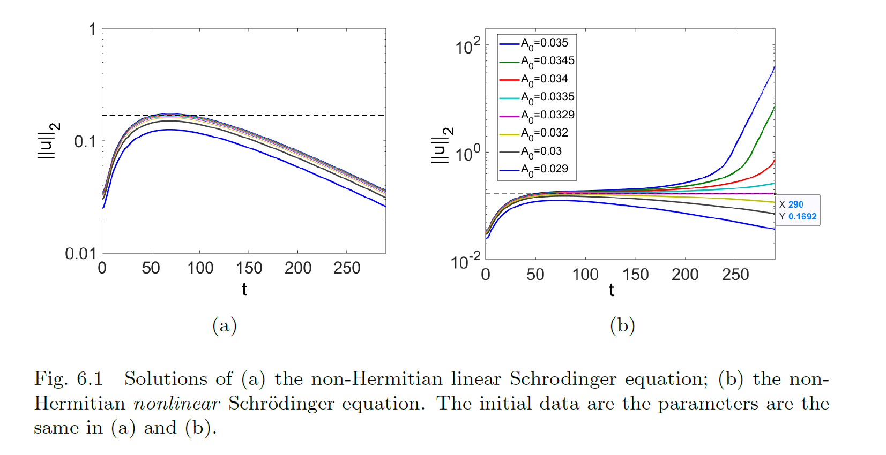

# TransientGrowth

This directory contains a simple ODE solver to solve the following complex-valued ODE:

$$
i\frac{du}{dt}=Hu+i(\mu_0 \mathbb{I}+G)u+a 
\begin{pmatrix}
|u_1|^2 & 0 \\
0 & |u_2|^2
\end{pmatrix}
$$

Here, $u=(u_1,u_2)^T$ is a complex-valued vector in $\mathbb{C}^2$, and $a$ is a real parameter.  In this context, $H$ and $G$ are real-valued $2x2$ Hermitian matrices:

$$
H=\begin{pmatrix}
E_0 & A \\
A & E_0
\end{pmatrix}
$$

and

$$
G=\begin{pmatrix}
-g_1 & 0 \\
0 & -g_2
\end{pmatrix}
$$

This equation is studied in the context of transient growth in Fluid Dynamics, in <b>Chapter 6</b> of the reference text.

# Linear Problem

The linearization of the ODE is written as follows:

$$
i\frac{du}{dt}=Hu+i(\mu_0 \mathbb{I}+G)u
$$

If we write $u=u_0e^{-i\omega t}$, then the eigenvalues $\omega$ are complex-valued, with $\omega=\omega_r+i\omega_i$ given by:

$$
\omega_r=E_0\pm (1/2)\sqrt{4A^2-(g_1-g_2)^2},   \qquad \omega_i=\mu_0-(1/2)(g_1+g_2)
$$

in <b>Case 1</b> with $4A^2>(g_1-g_2)^2$, and

$$
\omega_r=E_0, \qquad \omega_i=\mu_0-(1/2)(g_1+g_2)\pm (1/2) \sqrt{ (g_1-g_2)^2-4A^2}
$$

in <b>Case 2</b> with $4A^2<(g_1-g_2)^2$.

# Transient Growth

In cases where the eigenvalues of the linear problem are negative, the full non-linear ODE may exhibit transient growth, due to the non-normal natrue of the matrix

$$
H+i(\mu_0 \mathbb{I}+G).
$$

Furthermore, the nonlinear term is such that once transient growth occurs, explosive nonlinear growth of the amplitude $||u||_2^2$ follows.  This is illustraed in the figure below.

# A note on the time-marching algorithm

The ODE solver `my_ode_modelB.m` calls ode87, and eigth-order accurate RK solver for Matlab developed by V. N. Govorukhin.  The ode87 solver can be downloaded from the .
The solver has also been placed in this current directory for ease of use.  The authorship of `ode87.m` by Govorukhin is greatefully acknowledged.

