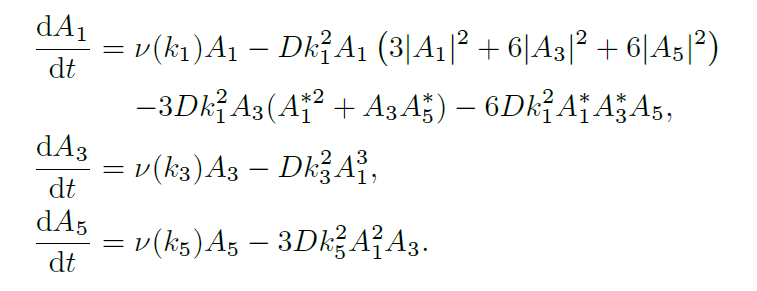
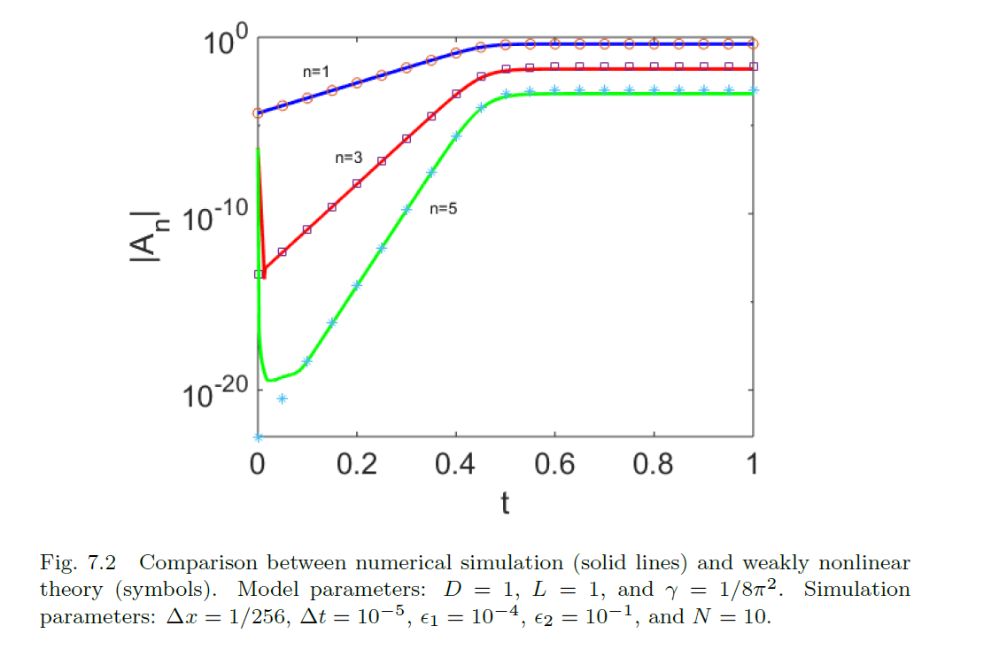

# WeaklyNonlinearTheory

In <b>Chapter 7</b> of the reference text, various 1D partial differential equations (PDEs) with periodic boundary conditions are investigated.  The equations are inspired by applications in Physics, meaning they have a well-defined threshold for the onset of linear instability.  Based on the PDEs, the Fourier amplitudes (or normal modes) of the solution are computed, and are found to solve a system of coupled ODEs.  Typically, there are infinitely many degrees of freedom in the system of coupled ODEs.  However, just beyond the threshold for the onset of linear instability, an approximation can be made which greatly simplifies this coupled system.  This approxiation goes by the name of <b>weakly nonlinear theory</b>.

# Cahn-Hilliard Equation

In this repository, the Cahn-Hilliard equation in one spatial dimension is introduced as a use case of weakly nonlinear analysis.  The equation reads:

$$
\frac{\partial C}{\partial t}=D\frac{\partial^2}{\partial x^2}(C^3-C-\gamma \partial_{xx}C),\qquad t>0,\qquad x\in (0,L),
$$

with initial data $C(x,t=0)=C_{init}(x)$ and periodic boundary coditions on the interval $(0,L)$.  Also, $D$ and $\gamma$ are positive constants.

The solution $C(x,t)$ can be written in term sof Fourier modes:

$$
C(x,t)=\sum_{n=-\infty}^\infty A_n(t)e^{i k_n x},\qquad k_n=(2\pi/L)n,\qquad A_{-n}=A_n^*
$$

hence

$$
A_n=\frac{1}{L}\int_0^L C(x,t)e^{-i k_n x}dx
$$

In terms of Fourier amplitudes, the Cahn-Hilliard equation becomes:

$$
\frac{dA_n}{dt}=\nu(k_n)A_n-Dk_n^2\sum_{p=-\infty}^\infty \sum_{q=-\infty}^\infty A_p A_q A_{n-p-q},
$$

where $\nu(k)=Dk^2(1-\gamma k^2)$ gives the dispersion relation for the linearized Cahn-Hilliard equation.

# Matlab code

The code `ch_one_d_solve.m` solves the 1D Cahn-Hilliard code using a semi-implicit pseodospectral numerical method described in <b>Section 7.3</b> of the reference text.  The input variable is `t_final` which is the final time to which the simulation is run.  The output variables are:

* xx - array of discrete x-points
* c - corresponding array of c-points
  
These can be plotted, e.g.

``plot(xx,c)``

* t_out - array of discrete time ponts
* a1,...,a5 - first five Fourier modes, corresponding to n=1,2,3,4, and n=5.

* These can be plotted, e.g.

``plot(t_out,abs(a1))``

Other key input parameters are fixed in `fix_all_parameters.m`

# Truncated Set of Equations

Just above criticality, in a parameter regime where there is only a single unstable mode, the infinite-dimensional set of amplitude euations maybe truncated.  One particularly simple truncation involves only three modes and is shown below:

The code ``ch_ode_solve.m`` solves this set of three coupled equation.

Results showing the comparison between the simple three-equation model and solutions of the full CH equation are shown below.

