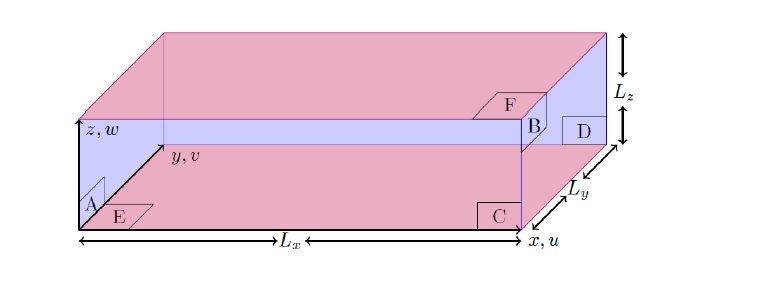

# sTPLS

This directory contains a Fortran 90 Navier-Stokes solver which simulates turbulent channel flow, using a Large-Eddy Simulation (LES) with a Smagorinsky closure model.  The computational domain is shown below.  The computational setup is described in detail in <b>Chapter 12</b> of the reference text.  This builds on an earlier publication by .  For maximum accessibility, it is the publication that is referred to here.   The arxiv version of the publication is available .

<b>Note:</b> the code was first hosted on [sourceforge](<https://sourceforge.net/p/tpls/code/HEAD/tree/trunk/s-tpls/>).  In May 2026 this code was downloaded to a local machine and some corrections were made (to bring the Fortran MPI into the present decade).  The resulting code was recompiled on a local machine and run for a test case.  Once tested, the code was uploaded here.

# Compiling code and running the code

The code comes in two modes.  In the first mode ("standard"), the simulation starts from $t=0$.  In the second mode ("restart"), it is assumed that the code has terminated in the standard mode at time $t_1$ and that restart files have been genrated.  The code can then be restarted at $t=t_1$ using the restart mode.

To compile both the standard and restart modes, use the provided Makefile.  To use it just run 'make' setting the MPIF90 variable if your MPI compiler is not 'mpif90'

The code is compiled in the first instance using the six files:

* momentum_stuff_allflux_LES.f90
* sor_iteration_allflux_spsrj.f90
* main_spsrj_LES.f90
* mpi_stuff.f90
* sphase_LES_initialisation.f90
* pressure_stuff.f90

and generates an executable

`s-tpls.x`

Every 1000 iterations data files are created, together with one of two restrart files - 
either fieldbackup0.dat or fieldbackup1.dat.  The file fieldbackup0.dat is created and 
refreshed  every Nx1000 iterations where N is even and fieldbackup1.dat is created and 
refreshed  every Nx1000 iterations where N is odd.  Thus, beyond 1000 iterations, there 
will always  be a restart file available - even if the code crashes when a particular 
restart file is being refreshed.

Note that the periodicity of the data creation (i.e. 1000) can be changed in the code.

In this way, the code can be restarted.  The restart code is compiled using the following 
six files:

* momentum_stuff_allflux_LES.f90
* sor_iteration_allflux_spsrj.f90
* main_spsrj_LES_restart.f90
* mpi_stuff.f90
* sphase_LES_initialisation.f90
* pressure_stuff.f90

and generates an executable:

`s-tpls-restart.x`

The restart time needs to be set on line 102 of main_spsrj_LES_restart.f90.  Also, the name 
of the particular backup file to be used needs to be set on line 1782.

# SRJ relaxation factors

The relaxation schedule for the SRJ method is referred to in Section 3 of the paper by  .  The 
schedule is generated by a matlab code given and described in the supplementary material to .  The resulting 
data files are provided here so that the code can be immediately used.  Two such files are 

* srj_relaxation_factors_P5_N32.dat
* srj_relaxation_factors_P5_N246.dat

The choice of file is selected in the main part of the code (main_spsrj_LES.f90 and
main_spsrj_LES_restart.f90) - search for "Get relaxation values for SRJ scheme"
