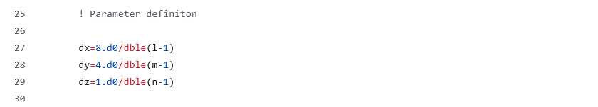
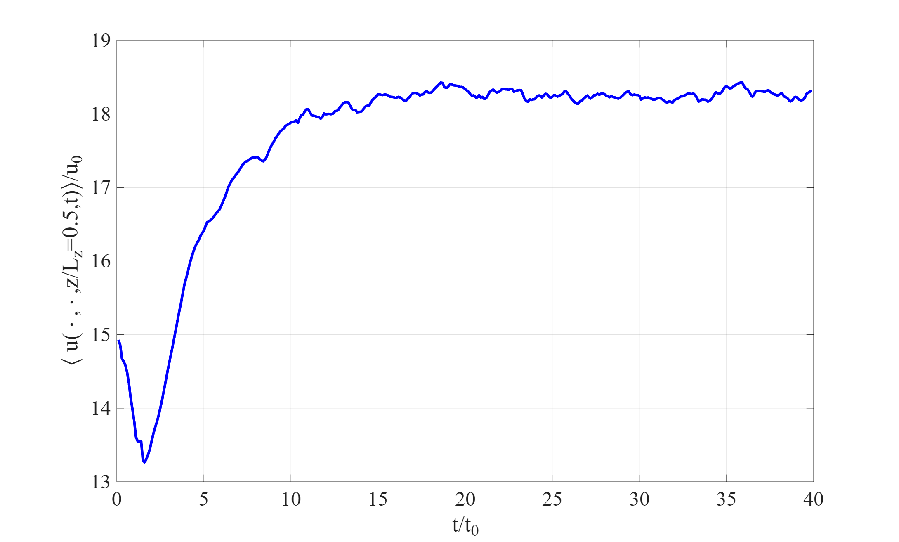
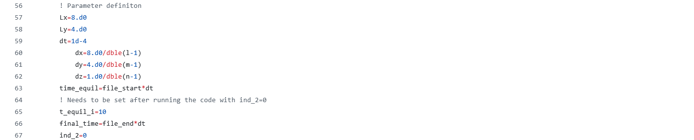
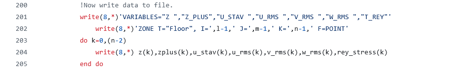
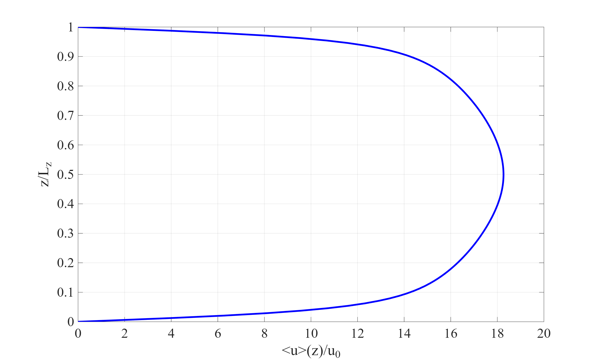

# sTPLS/postProcess

This directory contains a suite of Fortran 90 and Matlab codes to postprocess the simulation data coming from an LES simulation using sTPLS.  

# File Structure

The main thing to keep in mind is that sTPLS outputs data every 1000 iterations, in files of the form `sp3dchannel_    N.dat`  Here, N is in integer divisible by 1000.  The white spaces are deliberate - these are to ensure the files appear in an ordered fashion in the directory hosting them.  These are very large files - it is not advisable to open them.  The first few lines are as follows:

These columns correspond to $(x,y,z)$ coordinates (first three columns), $(u,v,w)$ velocities (next three columns).  The last two columns correspond to pressure and eddy viscosity.  

# make_slices.f90

<b>Inputs:</b>  The code reads in the files `sp3dchannel_    N.dat`, where $N$ is an integer label:

* The code operates on a sequential list of `sp3dchannel_.dat` files, starting with `sp3dchannel_    Nstart.dat` and ending with `sp3dchannel_    Nend.dat`.
* The integer $N$ is stepping up in increments of $\Delta N$ starting at $N=N_{start}$ and ending at $N=N_{end}$.
* In this example, $\Delta N=1000$.

<b>Outputs:</b> For each $N$, two corresponding slices are generated: one slice in the $xz$ plane at $y=L_y/2$ and one slice in the $xy$ mindplane at $z=L_z/2$.  The slices are stored in new `.dat` files.  Two such `.dat` files are provided in this repository:

* 2dslice_xy_ 12000.dat
* 2dslice_xz_ 12000.dat

These can be visualized - e.g. the Matlab code `plot_slice.m` extracts slices in the $xz$-plane, which can then be visualized, as in the below cartoon.

<b>Compilation:</b>  E.g. `gfortran -O3 make_slices.f90 -o slice.x` 

<b>Execution:</b> Type `/slice.x` at the command line.

<b>A note of caution:</b> The code should be configured so that the size of the velocity and pressure arrays matches with the size of the same arrays in sTPLS.   Similarly for $Nstart$, $Nend$, and $\Delta N$.

These parameters have to be specified via hard-coding.  This can be seen on line 18 of the code, and is also shown here in the following cartoon:

In the same way, the domain scales $L_x$, $L_y$, and $L_z$ are hard-coded on lines 27-29, shown here also in the following cartoon:

# data_analysis_0804.f90

Similar to the previous code, this file reads in the files `sp3dchannel_    N.dat` and performs spatio-temporal averaging.    For a generic quantity $\psi(x,y,z,t)$, the spatio-temporal average $\langle \psi\rangle(z)$ is defined as:

$$
\psi(z)=\frac{1}{t_2-t_1}\frac{1}{L_x L_y}\int_{t_1}^{t_2}dt\int_0^{L_x}dx\int_0^{L_y}dy \psi(x,y,z,t).
$$

Here, $t_1$ is the first time at which the simulation reaches a statistically steady state and $t_2$ is the final time of the simulation.  The aim of this code is to calculate such spatio-temporal averages, for various quantities of interest.

The code needs be executed twice, in a different mode each time.  The first time around, the value $t_1$ is computed.  The second time around, the spatio-temporal averages are computed.  The note of caution about the code configuration mentioned before applies here also.

<b>Inputs:</b>  The same as `make_slices.f90`.  The code reads in the files `sp3dchannel_    N.dat`, where $N$ is an integer label:

* The code operates on a sequential list of `sp3dchannel_.dat` files, starting with `sp3dchannel_    Nstart.dat` and ending with `sp3dchannel_    Nend.dat`.
* The integer $N$ is stepping up in increments of $\Delta N$ starting at $N=N_{start}$ and ending at $N=N_{end}$.
* In this example, $\Delta N=1000$.

<b>Outputs:</b> Various `.dat` files, to be described below.

<b>Compilation:</b>  E.g. gfortran -O3 data_analysis_0804.f90 -o averaging.x

<b>Execution:</b> Type `/averaging.x` at the command line.

In the <b>first mode</b>, the time $t_1$ for the simulation to reach a statistically steady state is computed.  This is done as follows:

* The flag `ind_2` is set to zero.
* The code executes an iterative loop over all files of the form `sp3dchannel_    Nstart.dat` to `sp3dchannel_    Nend.dat`.
* The code then computes the average value of $u$ averaged in the $x$ and $y$-directions.  The resulting average is evaluated at the channel midpoint $z=0.5$, and a time series $\phi(t)=\langle u(\cdot,\cdot,z=0.5,t)\rangle$ is built up.
* The time series $\phi(t)$ is then output to a file `u_max.dat`.
* The output is a file `u_max.dat` containing $t$-values and correspnding $\phi$-values.
*  A sample `u_max.dat` file is included here in this directory.
  
A visual plot of the results from this file is shown in the following figure:

By plotting the values of `u_max.dat` as a function of time as in the figure, the time for the simulation to reach a statistically steady state can be obtained.  This value is noted down.  The corresponding value of $N$ is identified with the variable name `t_equil_i`.  From the figure, the time at which the statistically steady state is reached is $t_1=15$.  Correspondingly, `t_equil_i` is given the value $150$.

In the <b>second mode</b>, the value of `t_equil_i` is updated and the code is recompiled (line 65).  The flag `ind_2` is set to two (line 67).  Relevant code lines are shown in the following cartoon:

Shown also are some of the other lines where parameter values are hard-coded and may need to be changed (see "a note of caution", above).

<b>Output:</b> The output of the code after the second time of running is produced on lines 200-205 of the code:

These are: the space-time average values of $u$, the RMS value of $u$, $v$, and $w$, and the Reynolds stress component $\tau_{xz}(z)$.  The $z$-coordinate is presented in standard units ($z/L$) and also in wall units.  The results are contained in the file `averaged_velocities.dat`.  A sample `averaged_velocities.dat` file is included in this directory.  A plot of the averaged streamwise velocity as a function of $z$ is given below.  

