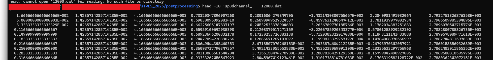
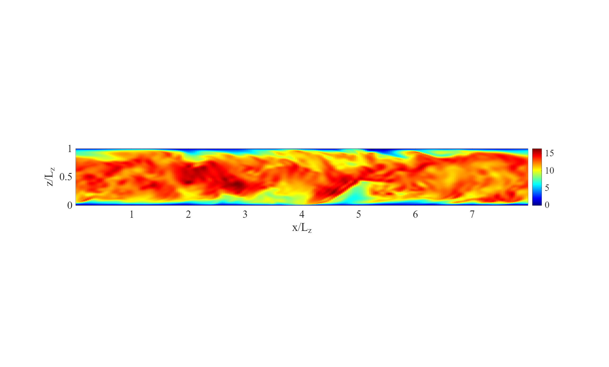
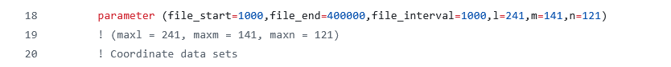

# sTPLS/postProcess

This directory contains a suite of Fortran 90 and Matlab codes to postprocess the simulation data coming from an LES simulation using sTPLS.  

# File Structure

The main thing to keep in mind is that sTPLS outputs data every 1000 iterations, in files of the form `sp3dchannel_    N.dat`  Here, N is in integer divisible by 1000.  The white spaces are deliberate - these are to ensure the files appear in an ordered fashion in the directory hosting them.  These are very large files - it is not advisable to open them.  The first few lines are as follows:

These columns correspond to $(x,y,z)$ coordinates (first three columns), $(u,v,w)$ velocities (next three columns).  The last two columns correspond to pressure and eddy viscosity.  

# make_slices.f90

This code reads in the files `sp3dchannel_    N.dat`, where $N$ is an integer label.  Here, we have in mind that the code is operating on a sequential list of `sp3dchannel_.dat` files, starting with `sp3dchannel_    Nstart.dat` and ending with `sp3dchannel_    Nend.dat`.   Thus, the integer $N$ is stepping up in increments of $\Delta N$ starting at $N=N_{start}$ and ending at $N=N_{end}$.  In this example, $\Delta N=1000$.

For each $N$, two corresponding slices are generated: one slice in the $xz$ plane at $y=L_y/2$ and one slice in the $xy$ mindplane at $z=L_z/2$.  The slices are stored in new `.dat` files.  Two such `.dat` files are provided in this repository:

* 2dslice_xy_ 12000.dat
* 2dslice_xz_ 12000.dat

These can be visualized - e.g. the Matlab code `plot_slice.m` extracts slices in the $xz$-plane, which can then be visualized, as in the below cartoon.

The Fortran code can be compiled in the usual way, e.g. `gfortran -O3 make_slices.f90 -o slice.x` and can then be executed by typing `/slice.x` at the command line.

<b>A note of caution:</b> The code should be configured so that the size of the velocity and pressure arrays matches with the size of the same arrays in sTPLS.   Similarly for $Nstart$, $Nend$, and $\Delta N$.

These parameters have to be specified via hard-coding.  This can be seen on line 18 of the code, and is also shown here in the following cartoon:

# data_analysis_0804.f90

Similar to the previous code, this file reads in the files `sp3dchannel_    N.dat` and performs spatio-temporal averaging.  The code should be executed twice, in a different mode each time.  The <b>note of caution</b> about the code configuration mentioned before applies here also.

In the <b>first mode</b>, the flag `ind_2` is set to zero.  Then, the code executes an iterative loop over all files of the form `sp3dchannel_    Nstart.dat` to `sp3dchannel_    Nend.dat`.  The code then computes the average value of $u$ averaged in the $x$ and $y$-directions.  The resulting average is evaluated at the channel midpoint $z=0.5$, and a time series $\phi(t)=\langle u(\cdot,\cdot,z=0.5,t)\rangle$ is built up.  The time series $\phi(t)$ is then output to a file `u_max.dat`.

By plotting the values of `u_max.dat` as a function of time, the time for the simulation to reach a statistically steady state can be obtained.  This value is noted down.  The corresponding value of $N$ is identified with the variable name `t_equil_i`.

In the <b>first mode</b>, the flag `ind_2` is set to two.  The value of `t_equil_i` is updated and the code is recompiled....
